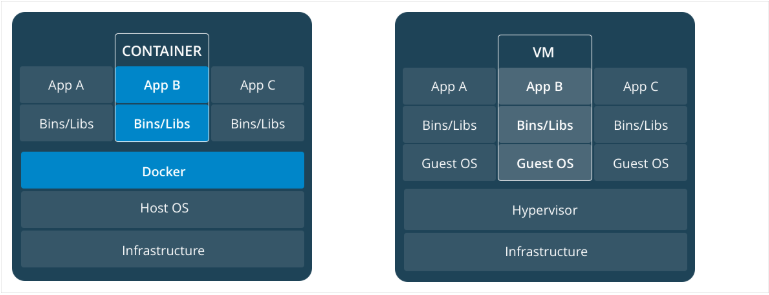

# Getting Started

## What is Docker?

Docker is a platform for developers and sysadmins to develop, deploy, and run applications with containers. The use of Linux containers to deploy applications is called containerization. Containers are not new, but their use for easily deploying applications is.

Containerization is increasingly popular because containers are:

- Flexible: Even the most complex applications can be containerized.
- Lightweight: Containers leverage and share the host kernel.
- Interchangeable: You can deploy updates and upgrades on-the-fly.
- Portable: You can build locally, deploy to the cloud, and run anywhere.
- Scalable: You can increase and automatically distribute container replicas.
- Stackable: You can stack services vertically and on-the-fly.

## Images and Containers

A container is launched by running an image. An image is an executable package that includes everything needed to run an application--the code, a runtime, libraries, environment variables, and configuration files.

A container is a runtime instance of an image--what the image becomes in memory when executed (that is, an image with state, or a user process). You can see a list of your running containers with the command, docker ps, just as you would in Linux.

## Containers and Virtual Machine

A container runs natively on Linux and shares the kernel of the host machine with other containers. It runs a discrete process, taking no more memory than any other executable, making it lightweight.

By contrast, a virtual machine (VM) runs a full-blown “guest” operating system with virtual access to host resources through a hypervisor. In general, VMs provide an environment with more resources than most applications need.



## Run Docker Contianer

Run your first container

```bash
$ docker run ubuntu echo 'Hello World'
Unable to find image 'ubuntu:latest' locally
latest: Pulling from library/ubuntu
5b7339215d1d: Pull complete
14ca88e9f672: Pull complete
a31c3b1caad4: Pull complete
b054a26005b7: Pull complete
Digest: sha256:9b1702dcfe32c873a770a32cfd306dd7fc1c4fd134adfb783db68defc8894b3c
Status: Downloaded newer image for ubuntu:latest
Hello World
```

- `run` is a docker subcommand
- `ubuntu` is the docker image
- `echo 'Hello World` is a command that will run inside docker container

Show your docker images

```bash
$ docker images
REPOSITORY          TAG                 IMAGE ID            CREATED             SIZE
ubuntu              latest              d131e0fa2585        2 days ago          102MB
```

List all your containers

```bash
$ docker container list -a
CONTAINER ID        IMAGE               COMMAND                CREATED              STATUS                          PORTS               NAMES
93ba62ada01e        ubuntu              "echo 'Hello World'"   About a minute ago   Exited (0) About a minute ago                       cranky_bassi
```

*You can also run `docker ps -a` to show list all of your container*

Run container with interactive mode

```bash
$ docker run --name myubuntu -it ubuntu bash
```

- `--name myubuntu` Assign myubuntu name to the container
- `-it` Give interactive STDIN and allocate a pseudo-TTY

## Build Docker Image

Create a Dockerfile under `hello-go` directory with following content

```Dockerfile
FROM golang:1.12
WORKDIR /go/src/github.com/fossildev/hello-go
COPY . .
RUN CGO_ENABLED=0 GOOS=linux go build -o /app/hello-go main.go
EXPOSE 9000
ENTRYPOINT [ "/app/hello-go" ]
```

- `FROM` Base image that will be used.
- `WORKDIR` Set the working directory
- `COPY` Copy a file or directory
- `RUN` Execute a commands when build image
- `EXPOSE` Indicates the ports on which a container listens for connections
- `ENTRYPOINT` Command that will be executed when the container is run.

Build image from Dockerfile

```bash
$ docker build -t hello-go example/hello-docker/hello-go
```

Run the image in docker container

```bash
$ docker run --rm -d \
    --name hello-go \
    -p 9000:9000 hello-go
```

- `--rm` Automatically remove the container when it exits
- `-d` Run container in background
- `-p` Publish a container's port(s) to the host `HOST_PORT:CONTAINER_PORT`

## Publish Docker Image to DockerHub Registry

Make sure you have a docker id and login from docker command line

```bash
$ docker login
Login with your Docker ID to push and pull images from Docker Hub. If you dont have a Docker ID, head over to https://hub.docker.com to create one.
Username: YOUR_DOCKER_ID
Password:

Login Succeeded
```

Tagging hello-go image with your docker id

```
$ docker tag hello-go:latest YOUR_DOCKER_ID/hello-go:latest
```

Push the hello-go image to docker registry

```bash
$ docker push YOUR_DOCKER_ID/hello-go:latest
The push refers to repository [docker.io/YOUR_DOCKER_ID/hello-go]
```

## Pull Docker Image from DockerHub Registry

```bash
$ docker pull nginx:latest
```

Run nginx in docker container

```bash
$ docker run --rm -d \
    --name web-server \
    -p 80:80 \
    -v $(pwd)/example/hello-docker/nginx/config/conf.d:/etc/nginx/conf.d:ro \
    -v $(pwd)/example/hello-docker/nginx/html:/usr/share/nginx/html:ro \
    nginx:latest
```

- `--rm` Automatically remove the container when it exits
- `-d` Run container in background
- `-p` Publish a container's port(s) to the host `HOST_PORT:CONTAINER_PORT`
- `-v` Bind mount a volume `HOST_DIR:CONTAINER_DIR`

## Logging and Debugging Docker Container

Show logs of a docker container

```bash
$ docker logs web-server
```

Get information of docker object

```bash
$ docker inspect web-server
```

## Stopping and Removing Docker Container

Stop `hello-go` container

```bash
$ docker stop hello-go
hello-go
```

Remove stopped docker container

```bash
$ docker rm myubuntu
myubuntu
```

## Docker Network

Docker Network driver

- **bridge** network are best when you need multiple containers to communicate on the same Docker host.
Host networks are best when the network stack should not be isolated from the Docker host, but you want other aspects of the container to be isolated.
- **Overlay** networks are best when you need containers running on different Docker hosts to communicate, or when multiple applications work together using swarm services.
- **Macvlan** networks are best when you are migrating from a VM setup or need your containers to look like physical hosts on your network, each with a unique MAC address.
- **Third-party** network plugins allow you to integrate Docker with specialized network stacks.


Create docker network with **bridge** driver

```bash
$ docker network create --driver bridge hello-net
```

Show list docker network

```bash
$ docker network ls
NETWORK ID          NAME                DRIVER              SCOPE
93103df0e720        bridge              bridge              local
04ad51089ec2        hello-net           bridge              local
22ecc869bad3        host                host                local
8c3d7d9ad916        none                null                local
```

Connect docker container to network

```bash
$ docker network connect hello-net web-server
```

Run docker container with spesific network

```bash
$ docker run --rm -d \
    --name hello-go \
    --network hello-net 
    hello-go 
```

- `--rm` Automatically remove the container when it exits
- `-d` Run container in background
- `--network` Run docker container with spesific network

## Docker Volume

Create docker volume

```bash
$ docker volume create --driver local hello-vol
hello-vol
```

Show list docker volume

```bash
$ docker volume ls
DRIVER              VOLUME NAME
local               hello-vol
```

## Clean Up

Stop container

```bash
$ docker stop hello-node hello-go web-server
hello-node
hello-go
web-server
```

Remove unused network

```bash
$ docker network prune
WARNING! This will remove all networks not used by at least one container.
Are you sure you want to continue? [y/N] y
Deleted Networks:
hello-net
```

Remove unused volumes

```
$ docker volume prune
WARNING! This will remove all local volumes not used by at least one container.
Are you sure you want to continue? [y/N] y
Deleted Volumes:
hello-vol
```

## Exercise

- Build nodejs image in `example/hello-docker/hello-node` with tag `hello-node`.
- Run nodejs image container with container name `hello-node` and using `hello-net` network.